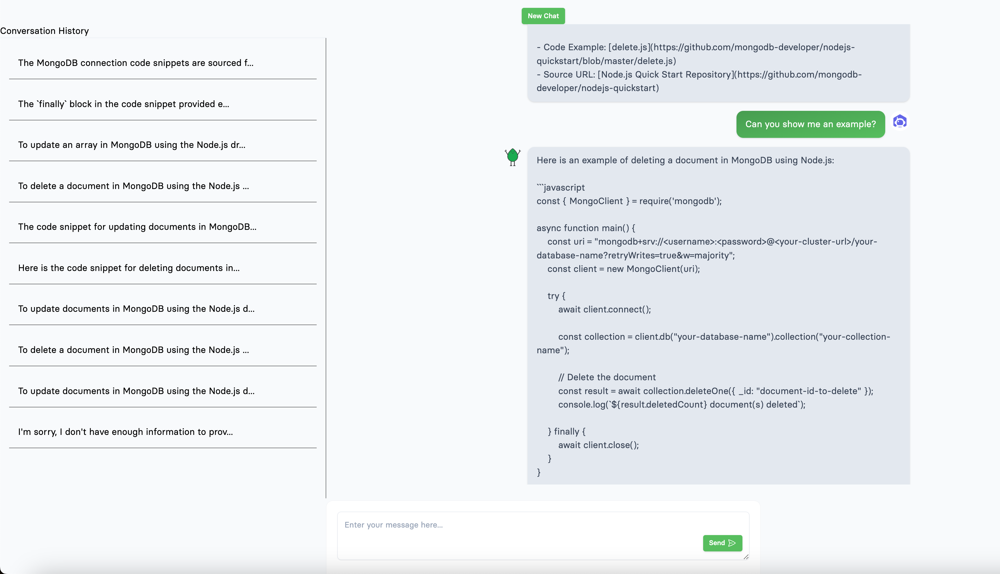

# Netlify, Next JS + MongoDB Atlas, powered by Open AI chatbot.
> Build and customize your own ChatGPT-like web app using Next.js, MongoDB Atlas and the OpenAI API. The provided code serves as a foundation, and you can customize it to fit your specific use case. The chatbot is contextual to your vector store operated by MongoDB, which serves as message and history repository for your chats.




## Overview

The application uses the following components:

- Next.js for the frontend and backend server
- MongoDB Atlas Data store and Atlas Vector Index.
- The OpenAI API for chat interactions
- Tailwind CSS for styling
- Apideck components for toast notifications and modals

## Setup MongoDB Atlas
1. Create or use an existing Atlas Cluster
- Verify that the IP's are whitelisted
- You have your connection string and credentials
2. Import data into the source collection which will be used as a vector store for the RAG of the chatbot. See [guide](src/data_ingestion/INSTALL.md).
3. Create the Atlas Vector Index named `vector_index` on that collection, example:
```
{
  "fields" : [
    {
      "type": "vector",
      "path": "embedding",
      "numDimensions" : <NUMBER>, // eg. 384
      "similarity" : "cosine"
    }
  ]
}
```


## Getting Started

1.  Clone the repository and navigate to the project directory.
    
2.  Install the required dependencies by running `npm install` or `yarn`.
    
3.  Create a `.env.local` file in the project root and add your OpenAI API key:
    ```
    OPENAI_API_KEY=your_openai_api_key
    MONGODB_ATLAS_URI=your_cluster_connection_string
    MONGODB_DATABASE=your_source_documents_database
    MONGODB_SOURCE_COLLECTION=your_embedded_collection
    ```
4.  Start the development server by running `netlify dev`.
    
5.  Open your browser and navigate to `http://localhost:8888` to access the application.
    
6.  You can now interact with the chatbot using the input field at the bottom of the screen.

## Deploy to netlify
1. Verify that your netlify command line is authenticated against your account.
```
netlify site:create
netlify build
## import .env
netlify env:import
netlify deploy 
```
    

## Customizing the Application

#### Model Selection (Optional)

The current implementation of the application uses the "gpt-3.5-turbo" model for chat interactions. This model provides excellent performance for a wide range of tasks and is the recommended choice for most use cases.

However, you might be interested in using other models such as GPT-4. As of March 25th, 2023, GPT-4 is available but in an invite-only mode. Your OpenAI account may not yet have access to it. If you do have access to GPT-4, you can change the model used in the application by modifying the `createMessage` function in the `/src/pages/api/createMessage.ts` file:

```typescript
const body = JSON.stringify({
  messages,
  model: 'gpt-4', // Replace 'gpt-3.5-turbo' with 'gpt-4'
  stream: false
})
``` 

Remember that the performance, response time, and pricing for different models may vary. Please refer to the OpenAI API documentation for more information on available models and their specific capabilities.

Feel free to modify the code and styles to fit your specific needs. The application uses Tailwind CSS for styling, making it easy to customize the design by modifying the `/src/styles/tailwind.css` and `/src/styles/globals.css` files.

You can also update the application logic, components, and API calls to match your requirements. The main chat functionality is located in `/src/utils/sendMessage.ts` and `/src/utils/useMessages.tsx`.

## Deploying to Production

Use netlify CLI to publish to prod:
```
netlify deploy --prod
```


If you have any questions or need further assistance, don't hesitate to create a GitHub issue!
